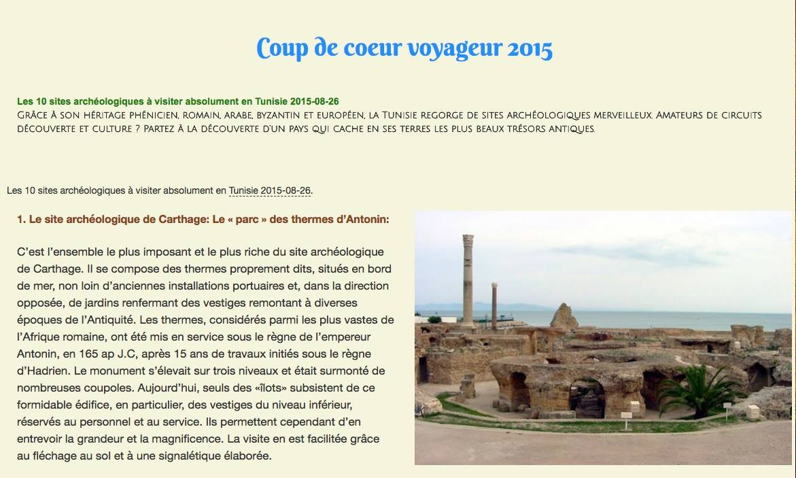
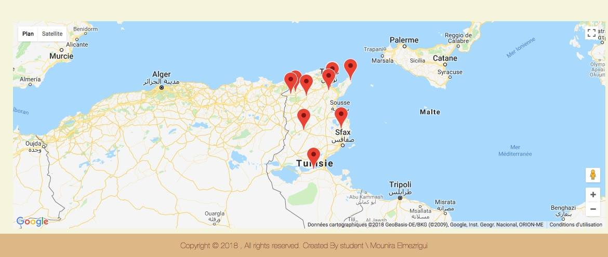
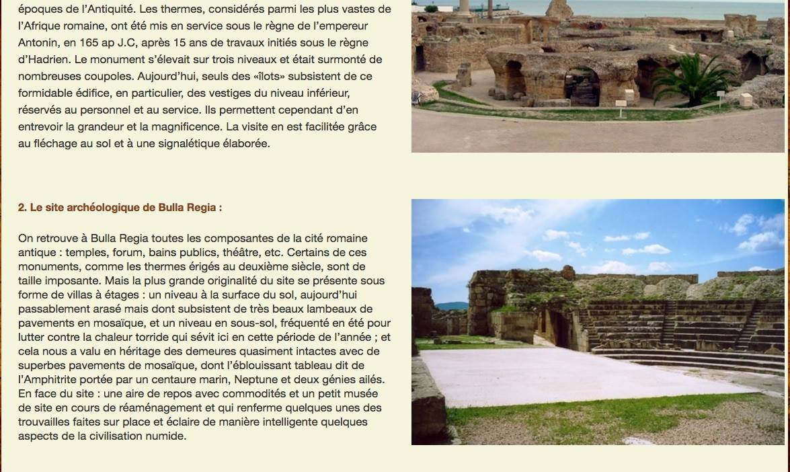

# pub_num
Publication numérique
1.	Introduction
Le livre présente les sites archéologiques en Tunisie, une description et une carte géographique qui montre les différents lieux qui se trouve dans le projet de publication numérique. 
L’idée du projet était de faire connaître, par une description détaillée, les lieux archéologique, Cette description se trouve sous forme de paragraphe sur le projet de publication numérique. A chaque paragraphe se trouve une image animée. L’objectif de ce projet est de réaliser un livre numérique simple et facile à lire pour les utilisateurs.  Le projet est fait pour l’ordinateur, la tablette et le téléphone portable. Le lien suivant en montre le résultat : 
https://github.com/mouniraa/pub_num/blob/master/pub_num/index.html
2.	Structure des fichiers : 
Fichier HTML (Hypertext Markup Language) : ce fichier, c’est la page principale de livre que nous avons réalisé. Ce fichier regroupe les liens des autres fichiers et elle sera affichée sur le navigateur.
Dossier CSS : qui contient les fichiers du format CSS (Cascading Style Sheets ou feuilles de style en cascade en français). Les fichiers CSS gèrent la présentation de document html et les animations du contenu ainsi que leur positionnement et leurs couleurs, etc.
Dossier JS : contient les fichiers du format JS
Dossier contenant tous les fichiers permettant de générer le livre.
Dossier image :
Tous les documents (exclus ceux directement consultés sur internet) utilisés comme référence pour la réalisation de ce projet (les autres références se trouvent dans le rapport).
3.	Fonctionnalités :
Le projet des sites archéologiques de Tunisie contient une interface principale qui regroupe les textes et les images et un background sous forme d’une image pour améliorer le style du livre. Ce livre se compose de trois parties : à gauche se trouve les textes et à droite les images et en bas la carte géographique. 
Le dossier dist : contient 2 fichiers (html5shiv.min et respond.min) nécessaire pour l’internet explorer, on va lier ces deux fichiers avec le code pour qu’on puisse voir le livre, organiser et s’adapter sur les navigateurs plus précisément sur internet explorer.
Les textes ont une animation spécifique et les images aussi lors de l’ouverture de notre livre. Puis, lorsque on clique sur chaque image, on voit une animation sur chacune.
Le projet contient le dossier de CSS, dans ce dossier on trouve un plugin pour l’animation des images et des textes.
Hover-min : c’est un fichier pour l’animation après l’ouverture de projet et lors d’un clic sur l’image.
Le fichier stype.css : c’est le fichier qui génère le style de notre livre.
Le fichier wow.min : nécessaire pour l’animation de texte et des images
Dossier image : regroupe toutes les images de notre projet.
Dossier javascript : contient le fichier js
dans le projet il y a un titre lorsqu'on fait un simple clic il afficher texte même exemple que expounder.

Le livre est responsive avec le fichier bootstrap « bootstrap-min ». On peut lire ce livre sur un ordinateur, une tablette ou un téléphone portable. Une barre de défilement se trouve à droite. 
La carte géographique contient les différents lieux de site qui se trouve en haut sous forme de texte. Chaque lieu sur la carte nous amène au texte qui convient.

En plus, un clic sur le titre du paragraphe, qui est le nom du site archéologique, va nous conduire vers la carte où se trouve ce dernier.

4.	 Auteur du travail
Ce travail a été réalisé par Mounira ELmezrigui dans le cadre du cours de « publication numérique » donné à l’Université de Lausanne (Unil) par Monsieur Isaac Pante. Le lien suivant permet d'accéder à la section des sciences du langages et de l'information de l'Unil pour plus de détails : https://www.unil.ch/sli/fr/home.html.
La licence se trouve derrière le lien suivant : LICENCE
5.	 Sources :
